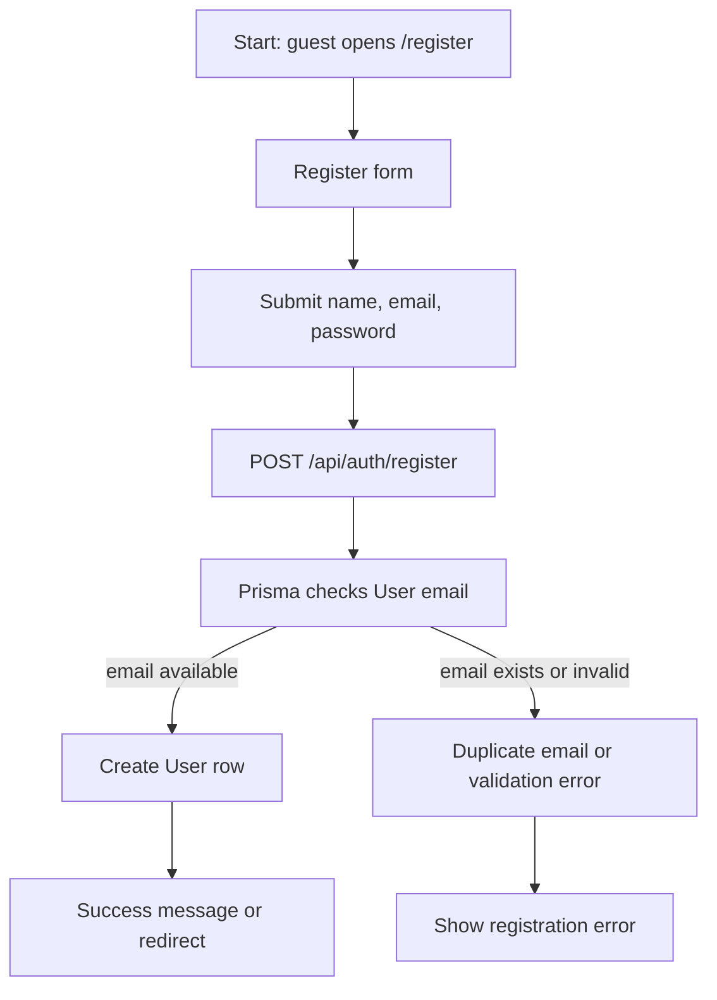
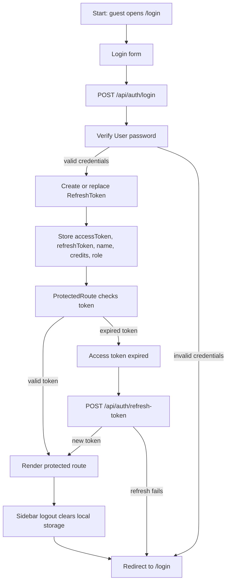
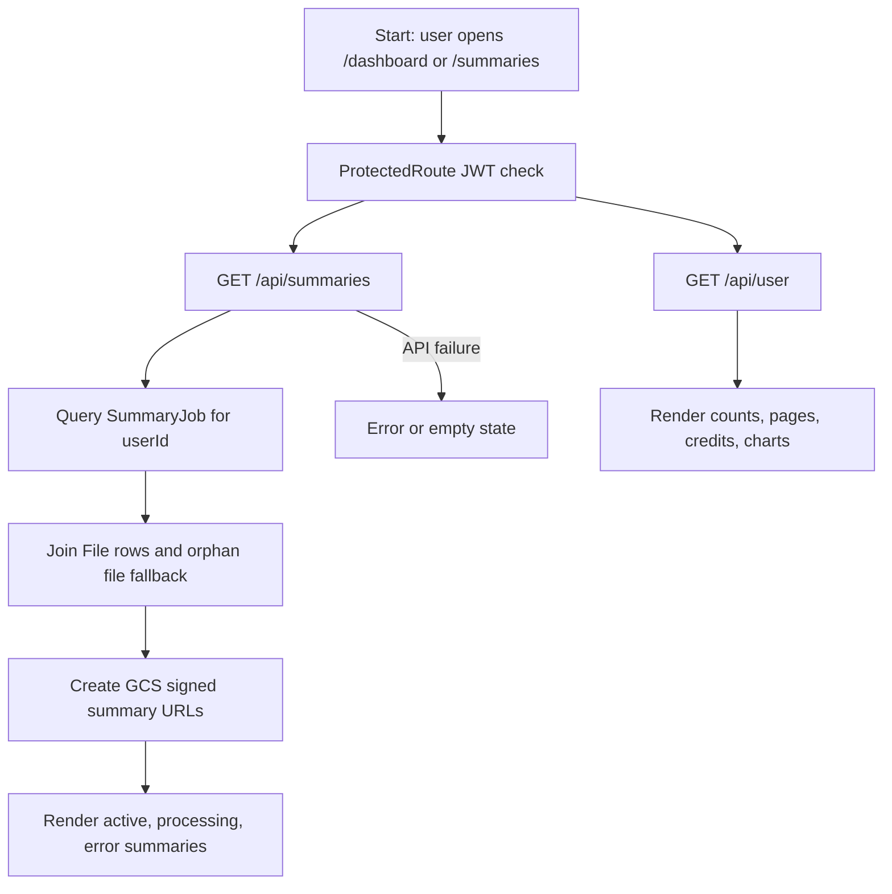
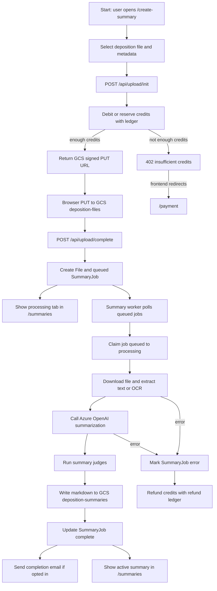
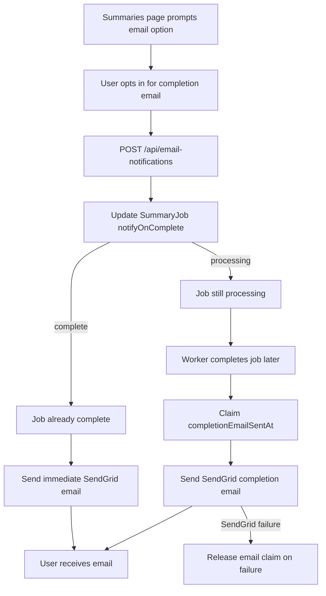
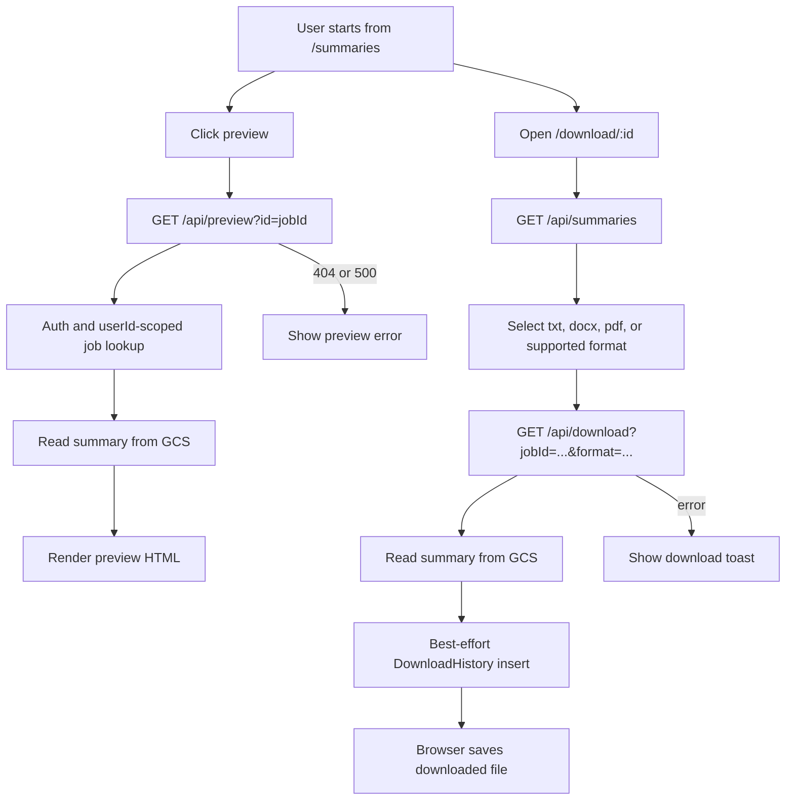
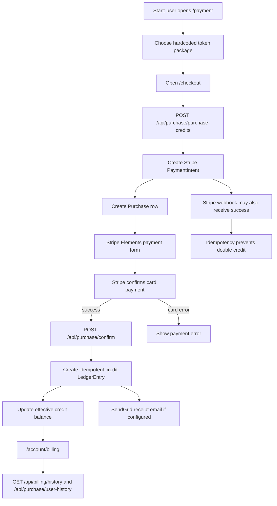
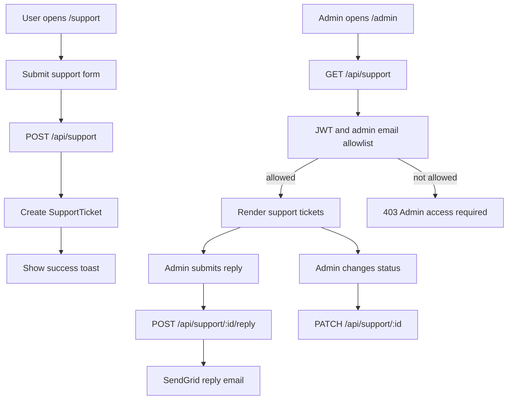
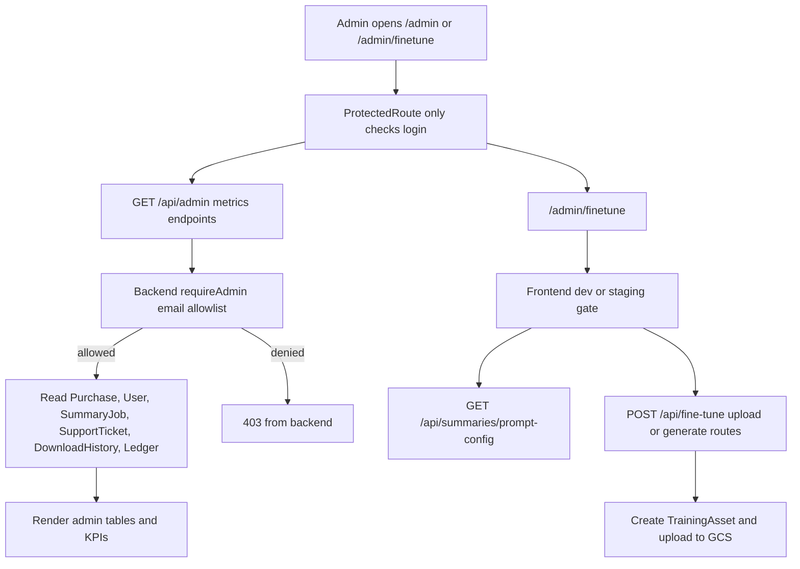

# Functionality and Manual Testing Guide

This guide documents the current application behavior observed in the codebase. It is intended for UAT planning and manual QA. Status labels mean:

- **Working**: frontend and backend wiring are visible and consistent in code.
- **Partial**: code exists, but behavior depends on integration setup, environment configuration, incomplete error handling, or a known gap.
- **UI Only**: route or component exists but uses static/mock data or no backend integration.
- **Broken**: code shows a likely mismatch or runtime issue.
- **Unknown**: cannot be verified from static code alone.

## 1. Executive Summary

TestifiAI is a deposition-summary web application. Users register, log in, purchase summary tokens, upload deposition files, and receive AI-generated summaries that can be viewed, previewed, downloaded, and optionally emailed when complete.

The application has three practical user roles:

- **Guest**: can access login, registration, password reset, terms, privacy, and 404 pages.
- **Authenticated user**: can use the dashboard, summaries, upload flow, billing, payments, support, help pages, download, and preview.
- **Admin**: can access admin dashboard and fine-tuning UI if they know the route. Backend admin APIs use a hardcoded email allowlist in `backend/src/middlewares/authMiddleware.ts`, while the frontend sidebar only checks `user.role === "admin"`.

The main workflows are authentication, credit purchase, file upload, AI summarization, summary notification, preview/download, billing history, support tickets, and admin reporting. The main external integrations are MySQL through Prisma, Google Cloud Storage, Google Vision OCR, Azure OpenAI, Stripe, SendGrid, and optional Slack or generic admin webhooks.

Overall UAT readiness is **partial**. Core user journeys are present in code, but several high-risk issues should be tested or fixed before broad UAT: a missing frontend-called summary detail endpoint, inconsistent admin enforcement, unauthenticated emergency/debug/snapshot routes, ownership-check gaps on selected APIs, UI-only pages that look like features, and environment-sensitive payment/email/AI flows.

Biggest risks:

- Summary detail route likely fails because `loveable/src/pages/SummaryDetail.tsx` calls `/api/summaries/view?id=...`, but `backend/src/routes/summariesRoutes.ts` does not define that endpoint.
- Admin frontend routes are not route-level admin guarded; sensitive data relies on backend API checks.
- Some backend endpoints are unauthenticated or insufficiently scoped to the requesting user.
- Upload, AI, email, and payment require several external services and environment variables to be correctly configured.
- There are duplicate backend-like trees at `src/` and `backend/src/`; the `backend/` tree appears to be the deployed backend source.

## 2. Zoomed-Out Application Diagram

```mermaid
flowchart TD
  guest["Guest"]
  user["Authenticated User"]
  admin["Admin User"]

  publicPages["Public Pages: login, register, forgot password, reset password, terms, privacy"]
  protectedShell["Protected React App"]
  dashboardPages["Dashboard and Summaries"]
  createSummaryPage["Create Summary"]
  billingPages["Payment, Checkout, Billing"]
  supportPages["Support and Help"]
  adminPages["Admin Dashboard and Fine Tune"]
  uiOnlyPages["UI Only Pages: automation, case prep, AI insights, collaboration"]

  authApi["/api/auth"]
  userApi["/api/user"]
  uploadApi["/api/upload"]
  summariesApi["/api/summaries"]
  downloadApi["/api/download"]
  previewApi["/api/preview"]
  purchaseApi["/api/purchase"]
  billingApi["/api/billing"]
  supportApi["/api/support"]
  adminApi["/api/admin"]
  emailApi["/api/email-notifications"]
  fineTuneApi["/api/fine-tune"]
  summaryJobsApi["/api/summary-jobs"]

  authMiddleware["JWT Auth Middleware"]
  adminMiddleware["Admin Email Allowlist"]
  prisma["Prisma ORM"]
  mysql["MySQL Database"]
  gcsFiles["GCS deposition-files"]
  gcsSummaries["GCS deposition-summaries"]
  worker["Summary Worker"]
  cleanupWorker["Cleanup Worker"]
  creditJob["Credit Expiration Job"]
  azureOpenAI["Azure OpenAI"]
  googleVision["Google Vision OCR"]
  stripe["Stripe"]
  sendgrid["SendGrid"]
  adminAlerts["Slack or Admin Webhook"]

  guest --> publicPages
  publicPages --> authApi
  authApi --> prisma
  prisma --> mysql

  user --> protectedShell
  protectedShell --> dashboardPages
  protectedShell --> createSummaryPage
  protectedShell --> billingPages
  protectedShell --> supportPages
  protectedShell --> uiOnlyPages
  admin --> adminPages

  dashboardPages --> summariesApi
  dashboardPages --> userApi
  createSummaryPage --> uploadApi
  billingPages --> purchaseApi
  billingPages --> billingApi
  supportPages --> supportApi
  adminPages --> adminApi
  adminPages --> fineTuneApi
  dashboardPages --> emailApi
  dashboardPages --> previewApi
  dashboardPages --> downloadApi

  uploadApi --> authMiddleware
  summariesApi --> authMiddleware
  downloadApi --> authMiddleware
  previewApi --> authMiddleware
  purchaseApi --> authMiddleware
  billingApi --> authMiddleware
  supportApi --> authMiddleware
  adminApi --> authMiddleware
  adminApi --> adminMiddleware
  fineTuneApi --> authMiddleware
  userApi --> authMiddleware
  emailApi --> authMiddleware
  summaryJobsApi --> authMiddleware

  uploadApi --> prisma
  uploadApi --> gcsFiles
  summariesApi --> prisma
  summariesApi --> gcsSummaries
  previewApi --> prisma
  previewApi --> gcsSummaries
  downloadApi --> prisma
  downloadApi --> gcsSummaries
  purchaseApi --> stripe
  purchaseApi --> prisma
  billingApi --> prisma
  supportApi --> prisma
  supportApi --> sendgrid
  emailApi --> prisma
  emailApi --> sendgrid
  fineTuneApi --> gcsFiles
  fineTuneApi --> prisma

  worker --> prisma
  worker --> gcsFiles
  worker --> gcsSummaries
  worker --> googleVision
  worker --> azureOpenAI
  worker --> sendgrid
  worker --> adminAlerts
  cleanupWorker --> prisma
  cleanupWorker --> gcsSummaries
  creditJob --> prisma
  stripe --> purchaseApi
```

## 3. Route and Feature Inventory

| Route/Page | Purpose | User role required | Main component/file path | API endpoints used | Database/models touched | Status | Notes |
|---|---|---|---|---|---|---|---|
| `/login` | User login | Guest | `loveable/src/pages/Login.tsx` | `POST /api/auth/login` | `User`, `RefreshToken` | Working | Stores access token, refresh token, credits, name, and role in local storage. |
| `/register` | Create account | Guest | `loveable/src/pages/Register.tsx` | `POST /api/auth/register` | `User`, `Email` | Working | Requires backend email uniqueness and configured DB. |
| `/forgot-password` | Request reset email | Guest | `loveable/src/pages/ForgotPassword.tsx` | `POST /api/auth/forgot-password` | `User`, `Email` | Working | Uses `VITE_API_URL` plus `/api/auth/forgot-password`. |
| `/reset-password/:token` | Set new password | Guest | `loveable/src/pages/ResetPassword.tsx` | `POST /api/auth/reset-password` | `User` | Partial | Uses relative `fetch("/api/auth/reset-password")`; verify proxy/base URL in deployed environments. |
| `/terms` | Terms page | Guest | `loveable/src/pages/Terms.tsx` | None | None | UI Only | Static public page. |
| `/privacy` | Privacy page | Guest | `loveable/src/pages/Privacy.tsx` | None | None | UI Only | Static public page. |
| `/` | Summary list home | Authenticated user | `loveable/src/pages/Summaries.tsx` | `GET /api/summaries`, `POST /api/email-notifications` | `SummaryJob`, `File` | Working | Main authenticated landing page. Query error may look like empty state. |
| `/summaries` | Summary list | Authenticated user | `loveable/src/pages/Summaries.tsx` | `GET /api/summaries`, `POST /api/email-notifications` | `SummaryJob`, `File` | Working | Shows processing, active, and error summaries based on mapped job status. |
| `/summaries/:id` | Summary detail | Authenticated user | `loveable/src/pages/SummaryDetail.tsx` | `GET /api/summaries/view?id=...`, fallback `GET /api/summaries` | `SummaryJob`, `File` | Broken | Backend route for `/api/summaries/view` is missing in `backend/src/routes/summariesRoutes.ts`. |
| `/preview/:id` | Full-page summary preview | Authenticated user | `loveable/src/pages/SummaryPreview.tsx` | `GET /api/preview?id=...` | `SummaryJob`, GCS summary object | Working | Backend scopes preview query by `userId`. |
| `/download/:id` | Download summary as file | Authenticated user | `loveable/src/pages/DownloadSummary.tsx` | `GET /api/summaries`, `GET /api/download?jobId=...&format=...` | `SummaryJob`, `File`, `DownloadHistory`, GCS summary object | Partial | Backend lacks visible user ownership check for `jobId`; frontend fallback filename may reference `summaryData.title` while list uses `fileTitle`. |
| `/dashboard` | Dashboard metrics | Authenticated user | `loveable/src/pages/Dashboard.tsx` | `GET /api/summaries`, `GET /api/user` | `SummaryJob`, `File`, `User`, ledger balance | Working | Displays summary counts, processing stats, credits, and chart widgets. |
| `/create-summary` | Upload a deposition for summarization | Authenticated user with credits | `loveable/src/pages/CreateSummary.tsx`, `loveable/src/components/summary/SummaryForm.tsx`, `loveable/src/components/dashboard/FileUploader.tsx` | `POST /api/upload/init`, GCS signed `PUT`, `POST /api/upload/complete` | `LedgerEntry`, `CreditAllocation`, `File`, `SummaryJob` | Working | 402 redirects to `/payment`. Worker completion is asynchronous. |
| `/payment` | Select token package | Authenticated user | `loveable/src/pages/Payment.tsx` | None directly | None | Partial | Plan cards are hardcoded in frontend; checkout performs backend payment calls. |
| `/checkout` | Stripe payment form | Authenticated user | `loveable/src/pages/Checkout.tsx`, `loveable/src/components/payment/StripeCheckoutForm.tsx` | `POST /api/purchase/purchase-credits`, `POST /api/purchase/update-payment-intent`, `POST /api/purchase/confirm` | `Purchase`, `LedgerEntry`, `CreditAllocation`, `User` | Partial | Requires `VITE_STRIPE_PUBLISHABLE_KEY`, `STRIPE_API_KEY`, webhook secret, and Stripe connectivity. |
| `/success` | Post-payment success | Authenticated user | `loveable/src/pages/Success.tsx` | React Query invalidations only | None directly | UI Only | Assumes Stripe flow has already credited account. |
| `/account/billing` | Billing and usage history | Authenticated user | `loveable/src/pages/Billing.tsx`, `loveable/src/components/billing/UsageHistory.tsx` | `GET /api/user/credits`, `GET /api/user`, `GET /api/purchase/user-history`, `GET /api/billing/history` | `Purchase`, `LedgerEntry`, `CreditAllocation`, `User` | Working | Has fallback from `/api/user/credits` to `/api/user`. |
| `/support` | Submit support ticket | Authenticated user | `loveable/src/pages/Support.tsx` | `POST /api/support` | `SupportTicket` | Working | Backend route also supports optional auth; in app route is protected. |
| `/help` | Help landing page | Authenticated user | `loveable/src/pages/Help.tsx` | `POST /api/webcopy` | File append via `WEB_COPY_PATH` | Partial | Main content is static; webcopy call is ancillary and silently ignored on failure. |
| `/help/user-guide` | Static user guide | Authenticated user | `loveable/src/pages/help/UserGuide.tsx` | `POST /api/webcopy` | File append via `WEB_COPY_PATH` | Partial | Static help content. |
| `/help/keyboard-shortcuts` | Static shortcuts page | Authenticated user | `loveable/src/pages/help/KeyboardShortcuts.tsx` | `POST /api/webcopy` | File append via `WEB_COPY_PATH` | Partial | Static help content. |
| `/security-commitment` | Security information | Authenticated user | `loveable/src/pages/SecurityCommitment.tsx` | None | None | UI Only | Protected but static. |
| `/admin` | Admin dashboard | Authenticated admin | `loveable/src/pages/Admin.tsx`, `loveable/src/components/admin/*` | `GET /api/purchase/history`, `GET /api/user/signups`, `GET /api/admin/metrics/downloads`, `GET /api/support`, `POST /api/support/:id/reply`, `PATCH /api/support/:id`, `GET /api/admin/billing/expired` | `Purchase`, `User`, `DownloadHistory`, `SupportTicket`, `SupportReply`, `LedgerEntry` | Partial | No frontend route-level admin guard; backend APIs enforce email allowlist or route-specific admin logic. |
| `/admin/finetune` | Prompt/fine-tune assets | Authenticated admin intended | `loveable/src/pages/AdminFineTune.tsx` | `GET /api/summaries/prompt-config`, `GET /api/fine-tune/history`, `POST /api/fine-tune/upload-human-summary`, `POST /api/fine-tune/upload-training-pair`, `POST /api/fine-tune/generate-pairs` | `TrainingAsset`, prompt config file/data | Partial | UI is disabled outside dev/staging heuristic; backend route only requires authentication, not admin allowlist. |
| `/automation` | Automation placeholder | Authenticated user | `loveable/src/pages/Automation.tsx` | None | None | UI Only | Coming-soon page. |
| `/case-preparation` | Case preparation concept page | Authenticated user | `loveable/src/pages/CasePreparation.tsx` | None | None | UI Only | Uses mock local state and is not active in sidebar. |
| `/ai-insights` | AI insights concept page | Authenticated user | `loveable/src/pages/AIInsights.tsx` | None | None | UI Only | Mock data, sidebar link commented out. |
| `/collaboration` | Team collaboration concept page | Authenticated user | `loveable/src/pages/Collaboration.tsx` | None | None | UI Only | Mock team data, sidebar link commented out. |
| `*` | 404 page | Any | `loveable/src/pages/NotFound.tsx` | None | None | Working | Return-to-home route points to protected `/`; guests will be redirected to login. |
| Not routed | Alternate index page | None | `loveable/src/pages/Index.tsx` | Unknown | Unknown | Unused | Imported in `App.tsx` but no route points to it. |
| Not routed | Alternate billing page | None | `loveable/src/pages/AccountBilling.tsx` | `GET /api/billing/history`, `GET /api/billing/balance` | `LedgerEntry`, `Purchase` | Unused | Implemented but not registered in `App.tsx`. |
| Not mounted | Prompt playground | None | `loveable/src/components/admin/PromptPlayground.tsx` | `GET /api/summaries/prompt-config`, `PUT /api/summaries/prompt-config` | Prompt config | Unused | Component exists but is not mounted in the current route tree. |

## 4. API and Backend Inventory

Backend entrypoint is `backend/src/server.ts`. It starts Express, registers Stripe webhook before JSON parsing, mounts routers under `/api/*`, starts the credit expiration job, and connects to Prisma/MySQL through `backend/src/lib/prisma.ts`.

| Method | Endpoint | Purpose | Called by which frontend route/component | Auth required | Request payload | Response shape | Database/models touched | Error handling | Status | Notes |
|---|---|---|---|---|---|---|---|---|---|---|
| `GET` | `/health` | Health check | Ops | No | None | `OK` | None | 200 only in normal path | Working | Public liveness/readiness. |
| `GET` | `/api/health` | API health check | Ops | No | None | `OK` | None | 200 only in normal path | Working | Public ingress health. |
| `POST` | `/api/test` | Debug echo endpoint | None | No | Any JSON | `{ message, body }` | None | Global 500 | Partial | Should not be public in production. |
| `POST` | `/api/emergency/reset-stuck-jobs` | Reset all processing jobs to queued | None | No | None | `{ message }` | `SummaryJob` | 500 with error | Partial | Unauthenticated operational endpoint. |
| `GET` | `/api/emergency/job-status` | List queued/processing jobs | None | No | None | `{ jobs }` | `SummaryJob` | 500 with error | Partial | Unauthenticated job data exposure. |
| `POST` | `/api/auth/register` | Create user account | `/register` | No | `{ name, email, password, companyName? }` | `{ message, userId }` | `User`, `Email` | Route async handler/global handler | Working | Duplicate email handling should be tested. |
| `POST` | `/api/auth/login` | Authenticate user | `/login` | No | `{ email, password }` | `{ accessToken, refreshToken, name, email, credits, role }` | `User`, `RefreshToken` | 4xx for invalid auth, global 500 | Working | Frontend stores tokens in local storage. |
| `POST` | `/api/auth/forgot-password` | Send password reset email | `/forgot-password` | No | `{ email }` | `{ message }` | `User`, `Email` | 404/500 depending path | Working | Requires SendGrid configuration for email delivery. |
| `POST` | `/api/auth/reset-password` | Save new password | `/reset-password/:token` | No | `{ token, password }` | `{ message }` | `User` | 400/404/500 depending token | Partial | Frontend URL base differs from other auth fetches. |
| `GET` | `/api/auth/get-reset-email?token=...` | Lookup reset email | None found | No | Query `token` | `{ email }` | `User` | 404/500 | Unused | Could support reset UI but not observed as called. |
| `POST` | `/api/auth/refresh-token` | Issue new access token | `ProtectedRoute`, `loveable/src/lib/axios.ts` | Refresh token body | `{ refreshToken }` | `{ accessToken }` | `RefreshToken`, `User` | 401/403/500 | Working | Two frontend refresh implementations build paths differently. |
| `POST` | `/api/upload/init` | Reserve credit and create signed GCS upload URL | `/create-summary` | JWT | `{ fileName, contentType, summaryName, deponent }` | `{ reservationId, objectKey, signedUrl, fileName }` | `LedgerEntry`, `CreditAllocation` | 402 insufficient credits, 500 | Working | Debits/reserves credit before browser upload. |
| `POST` | `/api/upload/complete` | Finalize GCS upload and create job | `/create-summary` | JWT | `{ reservationId, objectKey, fileName, summaryName, deponent, notifyOnComplete }` | `{ jobId, status }` | `File`, `SummaryJob`, ledger refund on failure | 400 if GCS object missing, 500 | Working | Creates queued job for worker. |
| `POST` | `/api/upload` | Legacy multipart upload | None obvious | JWT | Multipart file and metadata | Job/upload result | `File`, `SummaryJob`, ledger | 400/402/500 | Partial | App uses init/complete path instead. |
| `GET` | `/api/summaries` | List summaries for current user | `/`, `/summaries`, `/dashboard`, `/download/:id`, `/summaries/:id` fallback | JWT | None | Array of summaries with `id`, `fileTitle`, `summaryUrl`, status, page counts | `SummaryJob`, `File`, GCS signed URL | 500 `{ error }` | Working | Converts `complete` to `active`, `error` to `error`, others to `processing`. |
| `GET` | `/api/summaries/prompt-config` | Load prompt config | `/admin/finetune`, unused `PromptPlayground` | JWT | None | Prompt config JSON | Prompt config file/data | 500 `{ error }` | Partial | Not admin protected. |
| `PUT` | `/api/summaries/prompt-config` | Save prompt config | Unused `PromptPlayground` | JWT | `{ system, temperature, maxTokens }` | Saved config | Prompt config file/data | 500 `{ error }` | Unused | Component is not mounted. |
| `GET` | `/api/summaries/download-history` | Download history stub | None obvious | JWT | None | `[]` | None | 500 `{ error }` | Partial | Always returns empty array. |
| `GET` | `/api/download?jobId=...&format=...` | Download summary in selected format | `/download/:id` | JWT | Query `jobId`, `format` | Binary blob | `SummaryJob`, `File`, `DownloadHistory`, GCS | 4xx/500 depending file/job | Partial | Verify ownership check; supported formats include txt/docx/pdf branches. |
| `GET` | `/api/preview?id=...` | Render summary preview HTML | `/preview/:id`, preview modal | JWT | Query `id` | HTML string | `SummaryJob`, GCS | 404/500 | Working | Backend scopes to current `userId`. |
| `POST` | `/api/email-notifications` | Toggle/send completion notification | `EmailNotificationDialog` | JWT | `{ summaryId, notifyOnComplete }` | Updated notification result | `SummaryJob`, `User`, GCS, SendGrid | 404/500 | Working | If already complete and opted in, can send immediately. |
| `GET` | `/api/user` | Current user profile/credits | Sidebar, `/dashboard`, billing fallback | JWT | None | `{ credits, name, email, role }` | `User`, ledger balance | 401/403/500 | Working | Sidebar uses role to show admin links. |
| `GET` | `/api/user/credits` | Current user credits | `/account/billing` | JWT | None | `{ credits }` | `User`, ledger balance | 401/403/500 | Working | Billing page falls back to `/api/user`. |
| `GET` | `/api/user/signups` | Admin signup list | `/admin` | JWT plus admin allowlist | None | Array of signups | `User` | 403/500 | Working | Uses backend `requireAdmin`. |
| `POST` | `/api/purchase/purchase-credits` | Create Stripe PaymentIntent and purchase row | `/checkout` | JWT | `{ amount, credits, packageName? }` | `{ clientSecret, paymentIntentId }` | `Purchase`, Stripe | 400/500 | Working | Requires Stripe secret key. |
| `POST` | `/api/purchase/update-payment-intent` | Update payment intent/package | `/checkout` | JWT | Payment intent and package data | `{ clientSecret }` | `Purchase`, Stripe | 400/500 | Working | Used when checkout package changes. |
| `POST` | `/api/purchase/confirm` | Confirm successful payment and credit user | `StripeCheckoutForm` | JWT | `{ paymentIntentId }` | `{ balance, creditsAdded }` | `Purchase`, `LedgerEntry`, `CreditAllocation`, `User` | 400/500 | Working | Uses idempotent ledger key. |
| `POST` | `/api/purchase/stripe-webhook` | Stripe webhook handler | Stripe | Stripe signature | Raw Stripe event | `{ received: true }` or similar | `Purchase`, `LedgerEntry`, `CreditAllocation`, `User` | 400 invalid signature, 500 | Working | Must remain before JSON body parsing. |
| `GET` | `/api/purchase/history` | Admin purchase history | `/admin` purchase components | JWT plus admin allowlist | None | Array of purchase rows | `Purchase`, `User` | 403/500 | Working | Admin-only data. |
| `GET` | `/api/purchase/user-history` | Current user's purchases | `/account/billing` | JWT | None | Array of purchases | `Purchase` | 401/500 | Working | User billing history. |
| `GET` | `/api/billing/balance` | Effective credit balance | Unrouted `AccountBilling`, possible scripts | JWT | None | `{ balance }` | `LedgerEntry`, `CreditAllocation`, `Purchase`, `User` | 500/fallback paths | Working | Runs expiration logic for user. |
| `GET` | `/api/billing/history` | Ledger usage history and CSV export | `UsageHistory`, unrouted `AccountBilling` | JWT | Query filters/cursor; `Accept: text/csv` optional | JSON history or CSV | `LedgerEntry`, `Purchase`, `CreditAllocation` | 500 or fallback if table missing | Working | UAT should test JSON and CSV modes. |
| `POST` | `/api/billing/debit` | Manual/idempotent debit | None obvious | JWT | `{ summaryId, credits?, description? }` | Debit result or 402 | `LedgerEntry`, `CreditAllocation` | 400/402/500 | Partial | Upload flow uses shared debit helper instead. |
| `POST` | `/api/support` | Create support ticket | `/support` | Optional JWT | `{ name, email, subject, message }` | Created ticket/result | `SupportTicket` | 400/500 | Working | App route is protected, backend accepts optional auth. |
| `GET` | `/api/support` | Admin support ticket list | `/admin` support tab | JWT plus admin allowlist | None | Ticket array with replies | `SupportTicket`, `SupportReply` | 403/500 | Working | Admin-only. |
| `PATCH` | `/api/support/:id` | Update support ticket status | `/admin` support tab | JWT plus admin allowlist | `{ status }` | Updated ticket | `SupportTicket` | 403/404/500 | Working | Status enum values in Prisma. |
| `POST` | `/api/support/:id/reply` | Admin reply to support ticket | `/admin` support tab | JWT plus admin allowlist | `{ message }` | Reply result | `SupportReply`, `SupportTicket`, SendGrid | 403/404/500 | Working | Email delivery should be verified. |
| `GET` | `/api/admin/metrics/overview` | Admin KPIs | Admin dashboard components may call through controller set | JWT plus admin allowlist | Query optional | Metrics JSON | `Purchase`, `User`, `SummaryJob`, `SupportTicket`, ledger | 403/500 | Working | Mounted under `router.use(authenticateToken, requireAdmin)`. |
| `GET` | `/api/admin/metrics/revenue` | Revenue metrics | Admin dashboard | JWT plus admin allowlist | Query `period` | Metrics JSON | `Purchase` | 403/500 | Working | Periods include 7d/30d/90d/all style. |
| `GET` | `/api/admin/metrics/users` | User metrics | Admin dashboard | JWT plus admin allowlist | Query `period` | Metrics JSON | `User` | 403/500 | Working | Admin only. |
| `GET` | `/api/admin/metrics/summaries` | Summary metrics | Admin dashboard | JWT plus admin allowlist | Query `period` | Metrics JSON | `SummaryJob` | 403/500 | Working | Admin only. |
| `GET` | `/api/admin/metrics/downloads` | Download metrics | `AdminDownloads` | JWT plus admin allowlist | None | Metrics JSON | `DownloadHistory` | 403/500 | Working | Used directly by frontend. |
| `GET` | `/api/admin/metrics/support` | Support metrics | Admin dashboard | JWT plus admin allowlist | None | Metrics JSON | `SupportTicket` | 403/500 | Working | Admin only. |
| `GET` | `/api/admin/metrics/system-health` | Queue/system health | Admin dashboard | JWT plus admin allowlist | None | Health metrics JSON | `SummaryJob` | 403/500 | Working | Admin only. |
| `GET` | `/api/admin/billing/expired` | Expired credit aggregate | `PurchaseDashboard` | JWT plus admin allowlist | None | Expired credit summary | `Purchase`, `LedgerEntry`, `CreditAllocation` | 403/500 | Working | Used directly by frontend. |
| `POST` | `/api/admin/reset-stuck-jobs` | Admin reset stuck jobs | None obvious | JWT plus admin allowlist | None | Reset result | `SummaryJob` | 403/500 | Working | Safer duplicate of emergency endpoint. |
| `POST` | `/api/admin/reset-stuck-jobs-emergency` | Admin reset endpoint | None obvious | JWT plus admin allowlist | None | Reset result | `SummaryJob` | 403/500 | Partial | Comment says no auth, but router-level auth still applies. |
| `GET` | `/api/fine-tune/history` | List training assets | `/admin/finetune` | JWT | None | Training asset array | `TrainingAsset` | 401/500 | Partial | Not admin allowlist protected. |
| `POST` | `/api/fine-tune/upload-human-summary` | Upload human summary asset | `/admin/finetune` | JWT | Multipart file/metadata | Asset result | `TrainingAsset`, GCS | 400/500 | Partial | Intended admin feature, but backend only requires auth. |
| `POST` | `/api/fine-tune/upload-training-pair` | Upload training pair asset | `/admin/finetune` | JWT | Multipart file/metadata | Asset result | `TrainingAsset`, GCS | 400/500 | Partial | Dev/staging gated in UI. |
| `POST` | `/api/fine-tune/generate-pairs` | Generate training pairs | `/admin/finetune` | JWT | Multipart/input data | Generated asset result | `TrainingAsset`, GCS | 400/500 | Partial | External behavior needs UAT in staging. |
| `GET` | `/api/summary-jobs/:jobId` | Get job status | None obvious | JWT | Path `jobId` | Job status JSON | `SummaryJob` | 404/500 | Partial | No visible user ownership check in reviewed route. |
| `POST` | `/api/summary-jobs/upload` | Alternate upload/job creation | None obvious | JWT | Multipart file | Job result | `SummaryJob`, GCS | 400/500 | Partial | Different path from main upload and may bypass credit flow. |
| `POST` | `/api/snapshots` | Store UI snapshot | `useAutoSnapshots` if enabled | No | Multipart image | Snapshot result | Local filesystem | 400/500 | Partial | Unauthenticated local file write; gated only by frontend env. |
| `POST` | `/api/snapshots/meta` | Store snapshot metadata | `useAutoSnapshots` if enabled | No | Beacon body | Metadata result | Local filesystem | 500 | Partial | Unauthenticated. |
| `POST` | `/api/webcopy` | Append visible page copy | Help pages | JWT | `{ route, lines }` | Success result | Filesystem path from `WEB_COPY_PATH` | 500 | Partial | Default path may be developer-machine specific. |
| `POST` | `/api/validation/run` | Run summary validation | None obvious | JWT | `{ jobId, ... }` | Validation result | `SummaryJob`, GCS | 400/500 | Partial | No visible ownership check in controller path per review. |
| `GET` | `/api/debug/stripe-account` | Debug Stripe account | None | No | None | Stripe account data/error | Stripe | 500 if key missing | Partial | Should not be public in production. |
| `GET` | `/api/debug/stripe-key-prefix` | Debug Stripe key prefix | None | No | None | `{ keyPrefix }` | Env var | None | Partial | Leaks secret prefix. |
| `POST` | `/api/cleanup/summaries` | Cleanup expired summaries | None obvious | JWT plus role check | None | Cleanup result | `SummaryJob`, GCS | 403/500 | Partial | Uses `user.role === "admin"` rather than `requireAdmin` email allowlist. |
| `GET` | `/api/assets/:filename` | Serve whitelisted logos/assets | Email/logo usage | No | Path filename | Image file | Filesystem | 404/500 | Working | Only allowed filenames are served. |

## 5. Detailed Workflow Diagrams

### User Registration

### Login, Token Refresh, and Logout

### Dashboard and Summary List

### Upload, AI Summarization, and Refund-on-Failure

### Email Notification Flow

### Preview and Download

### Payment, Credits, and Billing

### Support and Admin Support

### Admin Metrics and Fine-Tune

## 6. Manual QA Test Plan

## Feature: Authentication

### Test Case: Register a New User

**Role:** Guest  
**Preconditions:** Unique email address not already present in `User`. Backend and database running.  
**Route/Page:** `/register`  
**Related Files:** `loveable/src/pages/Register.tsx`, `backend/src/routes/authRoutes.ts`, `backend/src/controllers/authController.ts`, `backend/prisma/schema.prisma`  
**Related API Endpoints:** `POST /api/auth/register`

**Steps:**
1. Go to `/register`.
2. Enter name, unique email, password, and any required fields shown.
3. Submit the form.
4. Observe the UI response.

**Expected Result:**
- The UI should show successful registration or move the user to the expected next auth step.
- The API should return a success response with a new `userId`.
- The database should contain a new `User` row with role `user` by default.
- Errors should be shown if required fields are missing or the email is duplicated.

**What to Verify:**
- Form validation for missing name, email, and password.
- Network request to `POST /api/auth/register`.
- `User` row creation in the database.
- Duplicate email behavior.
- No access token should be created unless the UI explicitly logs in after registration.

**Edge Cases:**
- Missing required fields.
- Invalid email format.
- Duplicate email.
- Weak or empty password.
- Slow API or 500 response.

**Priority:** Critical  
**Status:** Not Tested

### Test Case: Login and Access Protected Routes

**Role:** Existing user  
**Preconditions:** User account exists with valid password.  
**Route/Page:** `/login`, `/dashboard`, `/summaries`  
**Related Files:** `loveable/src/pages/Login.tsx`, `loveable/src/App.tsx`, `loveable/src/lib/axios.ts`, `backend/src/controllers/authController.ts`  
**Related API Endpoints:** `POST /api/auth/login`, `POST /api/auth/refresh-token`, `GET /api/user`

**Steps:**
1. Go to `/login`.
2. Enter valid credentials.
3. Submit the form.
4. Navigate to `/dashboard` and `/summaries`.
5. Log out from the sidebar.

**Expected Result:**
- The UI should store tokens and render protected pages after login.
- The API should return access token, refresh token, user info, credits, and role.
- The sidebar should show user credits and standard navigation.
- Logout should clear tokens and redirect to `/login`.

**What to Verify:**
- Network request to `POST /api/auth/login`.
- Local storage contains `token` and `refreshToken` after login.
- Protected route redirect when tokens are absent.
- Sidebar user request `GET /api/user`.
- Logout clears token, refresh token, and credits.

**Edge Cases:**
- Wrong password.
- Nonexistent account.
- Expired access token with valid refresh token.
- Expired or revoked refresh token.
- Direct navigation to `/admin` as non-admin.

**Priority:** Critical  
**Status:** Not Tested

### Test Case: Password Reset

**Role:** Guest  
**Preconditions:** Existing user email. SendGrid must be configured to verify email delivery.  
**Route/Page:** `/forgot-password`, `/reset-password/:token`  
**Related Files:** `loveable/src/pages/ForgotPassword.tsx`, `loveable/src/pages/ResetPassword.tsx`, `backend/src/controllers/authController.ts`  
**Related API Endpoints:** `POST /api/auth/forgot-password`, `POST /api/auth/reset-password`

**Steps:**
1. Go to `/forgot-password`.
2. Enter an existing account email.
3. Submit the request.
4. Open the reset link from the email.
5. Enter and submit a new password.
6. Log in with the new password.

**Expected Result:**
- The UI should show a reset email confirmation.
- The API should create reset token fields on the `User`.
- The user should receive a reset email if SendGrid is configured.
- Reset should update the hashed password and clear or invalidate the reset token.
- Old password should no longer work.

**What to Verify:**
- `POST /api/auth/forgot-password` uses the correct deployed API base.
- `POST /api/auth/reset-password` works in the deployed frontend environment.
- Email link points to the correct frontend base URL.
- Expired or invalid token handling.

**Edge Cases:**
- Unknown email.
- Invalid token.
- Expired token.
- Empty new password.
- SendGrid failure.

**Priority:** High  
**Status:** Not Tested

## Feature: Dashboard and Summaries

### Test Case: View Dashboard Metrics

**Role:** Authenticated user  
**Preconditions:** User has at least one existing summary job or a clean account for empty-state testing.  
**Route/Page:** `/dashboard`  
**Related Files:** `loveable/src/pages/Dashboard.tsx`, `loveable/src/components/summaries/SummaryMetrics.tsx`, `backend/src/routes/summariesRoutes.ts`, `backend/src/routes/userRoutes.ts`  
**Related API Endpoints:** `GET /api/summaries`, `GET /api/user`

**Steps:**
1. Log in as a standard user.
2. Go to `/dashboard`.
3. Observe metrics, charts, summary counts, and credits.
4. Refresh the page.

**Expected Result:**
- The UI should show dashboard metrics based on the user's summaries.
- The API should return only summaries for the authenticated `userId`.
- Credits should match the effective user credit balance.
- Empty accounts should show sensible empty states.

**What to Verify:**
- Summary counts by status.
- Credits in dashboard/sidebar.
- Loading state while requests are pending.
- Error message if `GET /api/summaries` fails.
- No other user's summaries appear.

**Edge Cases:**
- No summaries.
- Only processing summaries.
- Only error summaries.
- API failure.
- Expired session.

**Priority:** Critical  
**Status:** Not Tested

### Test Case: View Summary List and Email Prompt

**Role:** Authenticated user  
**Preconditions:** User has at least one processing or complete summary.  
**Route/Page:** `/summaries`  
**Related Files:** `loveable/src/pages/Summaries.tsx`, `loveable/src/components/dialogs/EmailNotificationDialog.tsx`, `backend/src/routes/summariesRoutes.ts`, `backend/src/routes/emailNotificationRoutes.ts`  
**Related API Endpoints:** `GET /api/summaries`, `POST /api/email-notifications`

**Steps:**
1. Go to `/summaries`.
2. Review active, processing, and error summaries.
3. Trigger the email notification dialog if available after upload or from the page flow.
4. Opt in or decline.

**Expected Result:**
- The UI should list summaries with correct names, statuses, page counts, and action buttons.
- The API should return only current user's `SummaryJob` records.
- Email opt-in should update `notifyOnComplete`.
- If the job is already complete and opt-in is true, an email may be sent immediately.

**What to Verify:**
- Network calls to `GET /api/summaries` and `POST /api/email-notifications`.
- Correct handling of complete, processing, and error statuses.
- Empty state when no summaries exist.
- Error state when API fails; current code may show a misleading empty state.

**Edge Cases:**
- Failed summary job with `error` message.
- Job with missing related `File` row.
- Slow polling/refetch.
- SendGrid failure on immediate notification.

**Priority:** Critical  
**Status:** Not Tested

### Test Case: Open Summary Detail

**Role:** Authenticated user  
**Preconditions:** User has a complete summary.  
**Route/Page:** `/summaries/:id`  
**Related Files:** `loveable/src/pages/SummaryDetail.tsx`, `backend/src/routes/summariesRoutes.ts`  
**Related API Endpoints:** `GET /api/summaries/view?id=...`, fallback `GET /api/summaries`

**Steps:**
1. Go to `/summaries`.
2. Click or navigate to a summary detail route `/summaries/:id`.
3. Observe whether the detail page loads.

**Expected Result:**
- Intended UI should show the selected summary details.
- Current backend code does not define `/api/summaries/view`, so the primary request is expected to 404.
- Fallback behavior may find metadata in `GET /api/summaries`, but it does not replace a full detail endpoint.

**What to Verify:**
- Network request to missing `GET /api/summaries/view?id=...`.
- UI error or fallback behavior.
- Whether this blocks UAT for summary reading.

**Edge Cases:**
- Invalid summary ID.
- Summary belongs to another user.
- Summary file missing in GCS.
- API 404.

**Priority:** Critical  
**Status:** Not Tested

## Feature: Upload and AI Summarization

### Test Case: Upload a Deposition with Available Credits

**Role:** Authenticated user  
**Preconditions:** User has at least one available credit. GCS, database, backend, and worker are configured.  
**Route/Page:** `/create-summary`  
**Related Files:** `loveable/src/pages/CreateSummary.tsx`, `loveable/src/components/summary/SummaryForm.tsx`, `backend/src/routes/uploadRoutes.ts`, `backend/src/worker/summarizeWorker.ts`, `backend/prisma/schema.prisma`  
**Related API Endpoints:** `POST /api/upload/init`, GCS signed `PUT`, `POST /api/upload/complete`, `GET /api/summaries`

**Steps:**
1. Go to `/create-summary`.
2. Enter summary name and deponent.
3. Select a supported deposition file.
4. Submit the form.
5. Observe upload progress messages.
6. After redirect to `/summaries`, watch the processing summary.
7. Wait for worker completion and refresh if needed.

**Expected Result:**
- The UI should show preparing, uploading, finalizing, then navigate to `/summaries`.
- The API should debit/reserve one credit during `/api/upload/init`.
- The browser should upload directly to GCS using the signed URL.
- `/api/upload/complete` should create `File` and `SummaryJob` rows.
- Worker should process the job, write a markdown summary to GCS, and mark `SummaryJob.status` as `complete`.
- Summary should appear as active in `/summaries`.

**What to Verify:**
- Credit balance decreases when upload is reserved.
- `SummaryJob` status progression: `queued`, `processing`, `complete`.
- `File` row contains title/deponent/file metadata.
- GCS source object exists in `deposition-files`.
- Summary object exists in `deposition-summaries`.
- Worker logs show Azure OpenAI processing.

**Edge Cases:**
- Missing file.
- Missing required summary name or deponent.
- Large file.
- GCS signed URL upload failure.
- Worker not running.
- Azure OpenAI failure.
- Scanned PDF requiring Google Vision OCR.

**Priority:** Critical  
**Status:** Not Tested

### Test Case: Upload with No Credits

**Role:** Authenticated user  
**Preconditions:** User has zero available credits.  
**Route/Page:** `/create-summary`  
**Related Files:** `loveable/src/components/summary/SummaryForm.tsx`, `backend/src/routes/uploadRoutes.ts`, `backend/src/routes/billingRoutes.ts`  
**Related API Endpoints:** `POST /api/upload/init`

**Steps:**
1. Go to `/create-summary`.
2. Fill required metadata and select a file.
3. Submit the form.
4. Observe redirect or error handling.

**Expected Result:**
- The API should return 402 or an insufficient-credit error.
- The UI should redirect to `/payment` with a reason.
- No `File` or `SummaryJob` should be created.
- No negative credit balance should be created.

**What to Verify:**
- Network status is 402.
- Credit ledger remains valid.
- User sees payment path.
- No orphan GCS upload occurs.

**Edge Cases:**
- Race condition with two uploads using one credit.
- Expired credits.
- Ledger table unavailable fallback.

**Priority:** Critical  
**Status:** Not Tested

### Test Case: AI Processing Failure Refunds Credit

**Role:** Authenticated user  
**Preconditions:** Non-production environment where worker failure can be safely simulated. User has credits.  
**Route/Page:** `/create-summary`, `/summaries`, `/account/billing`  
**Related Files:** `backend/src/worker/summarizeWorker.ts`, `backend/src/routes/billingRoutes.ts`, `backend/src/routes/uploadRoutes.ts`  
**Related API Endpoints:** `POST /api/upload/init`, `POST /api/upload/complete`, `GET /api/summaries`, `GET /api/billing/history`

**Steps:**
1. Configure or simulate a worker failure, such as invalid Azure OpenAI credentials in staging.
2. Upload a test file.
3. Wait for the worker to mark the job as error.
4. Open `/summaries` and `/account/billing`.

**Expected Result:**
- The summary job should show an error state.
- The worker should create an idempotent refund ledger entry.
- The user's effective balance should be restored.
- The UI should show the failed summary clearly.

**What to Verify:**
- `SummaryJob.status = "error"` and `error` is populated.
- Ledger contains debit and refund entries.
- Re-running failure handling does not double-refund.
- User-facing error is understandable.

**Edge Cases:**
- Worker crashes before refund.
- Judge failure only, which should not fail the job.
- GCS read failure.
- Azure timeout.

**Priority:** High  
**Status:** Not Tested

## Feature: Preview and Download

### Test Case: Preview a Completed Summary

**Role:** Authenticated user  
**Preconditions:** User has a completed summary with a GCS summary object.  
**Route/Page:** `/preview/:id`, summary preview modal if available  
**Related Files:** `loveable/src/pages/SummaryPreview.tsx`, `loveable/src/components/summaries/PreviewModal.tsx`, `backend/src/routes/previewRoutes.ts`  
**Related API Endpoints:** `GET /api/preview?id=...`

**Steps:**
1. Go to `/summaries`.
2. Open preview for a completed summary.
3. Verify the full-page preview route `/preview/:id` if linked.

**Expected Result:**
- The UI should show a loading overlay, then rendered summary HTML.
- The API should fetch a summary owned by the current `userId`.
- Missing or unauthorized summaries should show an error.

**What to Verify:**
- Network request includes auth token.
- Summary content matches expected GCS output.
- User cannot preview another user's summary ID.
- Error state for missing GCS object.

**Edge Cases:**
- Invalid ID.
- Job still processing.
- Summary file deleted by cleanup.
- Expired session.

**Priority:** High  
**Status:** Not Tested

### Test Case: Download a Completed Summary

**Role:** Authenticated user  
**Preconditions:** User has a completed summary.  
**Route/Page:** `/download/:id`  
**Related Files:** `loveable/src/pages/DownloadSummary.tsx`, `backend/src/routes/downloadRoutes.ts`, `backend/prisma/schema.prisma`  
**Related API Endpoints:** `GET /api/summaries`, `GET /api/download?jobId=...&format=...`

**Steps:**
1. Go to `/download/:id` for a completed summary.
2. Select each visible format, such as txt, docx, and pdf.
3. Click download.
4. Open the downloaded file.

**Expected Result:**
- The UI should download a valid file for each supported format.
- The API should read the summary markdown from GCS and return a blob.
- `DownloadHistory` should be inserted best-effort.
- Errors should show a toast rather than crashing.

**What to Verify:**
- Filename is sensible and does not crash if `Content-Disposition` is absent.
- Downloaded content matches the summary.
- `DownloadHistory` row includes user, file, format, and timestamp.
- Another user cannot download this job by guessing `jobId`.

**Edge Cases:**
- Missing summary object.
- Invalid format.
- Processing or error job.
- Unauthorized `jobId`.
- Browser popup/download blocking.

**Priority:** Critical  
**Status:** Not Tested

## Feature: Payment, Credits, and Billing

### Test Case: Purchase Credits with Stripe

**Role:** Authenticated user  
**Preconditions:** Stripe publishable key, Stripe secret key, webhook secret, and test card environment configured.  
**Route/Page:** `/payment`, `/checkout`, `/success`, `/account/billing`  
**Related Files:** `loveable/src/pages/Payment.tsx`, `loveable/src/pages/Checkout.tsx`, `loveable/src/components/payment/StripeCheckoutForm.tsx`, `backend/src/routes/purchaseRoutes.ts`, `backend/src/routes/billingRoutes.ts`  
**Related API Endpoints:** `POST /api/purchase/purchase-credits`, `POST /api/purchase/update-payment-intent`, `POST /api/purchase/confirm`, `POST /api/purchase/stripe-webhook`, `GET /api/billing/history`

**Steps:**
1. Go to `/payment`.
2. Select a token package.
3. Complete checkout with a Stripe test card.
4. Confirm success page or checkout success state.
5. Open `/account/billing`.

**Expected Result:**
- The UI should load Stripe Elements and complete payment.
- Backend should create a `Purchase` row and Stripe PaymentIntent.
- Confirm/webhook should create one credit ledger entry.
- User balance should increase by purchased credits.
- Purchase history and usage history should show the transaction.
- Receipt email should send if SendGrid is configured.

**What to Verify:**
- No double credit from both client confirm and webhook.
- `Purchase.status` is correct.
- Ledger idempotency key is based on payment intent.
- Sidebar and billing balance update.
- Receipt email content and branding.

**Edge Cases:**
- Declined card.
- User leaves checkout before paying.
- Webhook replay.
- Missing webhook secret.
- Stripe API failure.
- Package changed during checkout.

**Priority:** Critical  
**Status:** Not Tested

### Test Case: View Billing and Usage History

**Role:** Authenticated user  
**Preconditions:** User has at least one credit purchase and one upload debit.  
**Route/Page:** `/account/billing`  
**Related Files:** `loveable/src/pages/Billing.tsx`, `loveable/src/components/billing/UsageHistory.tsx`, `loveable/src/hooks/useBillingLedger.ts`, `backend/src/routes/billingRoutes.ts`  
**Related API Endpoints:** `GET /api/user/credits`, `GET /api/purchase/user-history`, `GET /api/billing/history`

**Steps:**
1. Go to `/account/billing`.
2. Review current credits.
3. Review purchase history.
4. Review usage history.
5. Export or request CSV if the UI exposes it.

**Expected Result:**
- The UI should show current credit balance, purchases, and ledger usage.
- The API should return only the current user's billing records.
- CSV response should download or render correctly when requested.

**What to Verify:**
- Credit balance matches ledger.
- Purchase rows match Stripe transactions.
- Debits correspond to summary uploads.
- Expired credit rows appear if expiration is simulated.

**Edge Cases:**
- No purchases.
- Ledger table fallback.
- Expired credits.
- Large ledger history with pagination/cursor.
- API failure in one tab but not another.

**Priority:** High  
**Status:** Not Tested

## Feature: Email Notifications

### Test Case: Completion Email for Processing Summary

**Role:** Authenticated user  
**Preconditions:** User has a processing job or can upload a new file. SendGrid configured.  
**Route/Page:** `/summaries`, `/create-summary`  
**Related Files:** `loveable/src/components/dialogs/EmailNotificationDialog.tsx`, `backend/src/routes/emailNotificationRoutes.ts`, `backend/src/worker/summarizeWorker.ts`, `backend/src/lib/sendEmail.ts`  
**Related API Endpoints:** `POST /api/email-notifications`

**Steps:**
1. Upload a file or open a processing summary.
2. Choose to receive email notification.
3. Wait for job completion.
4. Check the user's inbox.

**Expected Result:**
- `SummaryJob.notifyOnComplete` should be true.
- Worker should claim the completion email send once.
- User should receive one completion email.
- `completionEmailSentAt` should be populated.

**What to Verify:**
- No duplicate emails.
- Email links point to correct frontend URL.
- Email includes appropriate summary/download information.
- SendGrid failures are logged and retry-safe.

**Edge Cases:**
- User opts in after job already completed.
- SendGrid API key missing.
- Large attachment handling.
- Worker crash after claiming email.

**Priority:** High  
**Status:** Not Tested

## Feature: Support

### Test Case: Submit Support Ticket

**Role:** Authenticated user  
**Preconditions:** User is logged in.  
**Route/Page:** `/support`  
**Related Files:** `loveable/src/pages/Support.tsx`, `backend/src/routes/supportRoutes.ts`, `backend/prisma/schema.prisma`  
**Related API Endpoints:** `POST /api/support`

**Steps:**
1. Go to `/support`.
2. Fill name, email, subject, and message.
3. Submit the form.
4. Observe confirmation.

**Expected Result:**
- The UI should show a success message.
- The API should create a `SupportTicket` row.
- The ticket should be visible to admin users in `/admin`.

**What to Verify:**
- Required field validation.
- Ticket status defaults to `OPEN`.
- Current user ID is associated when token is provided.
- API handles optional auth correctly.

**Edge Cases:**
- Missing message.
- Invalid email.
- Very long message.
- API failure.

**Priority:** High  
**Status:** Not Tested

### Test Case: Admin Replies to Support Ticket

**Role:** Admin  
**Preconditions:** Admin email is in backend allowlist; at least one support ticket exists; SendGrid configured for reply email verification.  
**Route/Page:** `/admin`  
**Related Files:** `loveable/src/components/admin/AdminSupport.tsx`, `backend/src/routes/supportRoutes.ts`, `backend/src/middlewares/authMiddleware.ts`  
**Related API Endpoints:** `GET /api/support`, `POST /api/support/:id/reply`, `PATCH /api/support/:id`

**Steps:**
1. Log in as an allowed admin.
2. Go to `/admin`.
3. Open support tab.
4. Reply to a ticket.
5. Change the ticket status.

**Expected Result:**
- Admin can view tickets.
- Reply creates a `SupportReply` row and sends an email.
- Status update changes `SupportTicket.status`.
- Non-admin users receive 403 from backend endpoints.

**What to Verify:**
- Admin allowlist is enforced by email.
- UI handles 403 cleanly.
- Reply email delivery.
- Status persists after refresh.

**Edge Cases:**
- Admin role in DB but email not in allowlist.
- Email in allowlist but `User.role` is not `admin`.
- Reply to deleted/nonexistent ticket.
- SendGrid failure.

**Priority:** High  
**Status:** Not Tested

## Feature: Admin Dashboard and Fine-Tune

### Test Case: Admin Dashboard Access and Metrics

**Role:** Admin and non-admin  
**Preconditions:** One admin allowlisted account, one regular user account, sample purchases/summaries/support tickets.  
**Route/Page:** `/admin`  
**Related Files:** `loveable/src/pages/Admin.tsx`, `loveable/src/components/admin/*`, `backend/src/routes/adminRoutes.ts`, `backend/src/controllers/adminController.ts`, `backend/src/services/metricsService.ts`  
**Related API Endpoints:** `GET /api/purchase/history`, `GET /api/user/signups`, `GET /api/admin/metrics/downloads`, `GET /api/admin/billing/expired`, `GET /api/support`

**Steps:**
1. Log in as admin and open `/admin`.
2. Review purchases, signups, downloads, support, and billing/expired credit widgets.
3. Log out and log in as a regular user.
4. Directly open `/admin`.

**Expected Result:**
- Admin should see data tables and metrics.
- Regular user may load the route shell but backend admin API calls should return 403.
- No sensitive admin data should be visible to non-admin users.

**What to Verify:**
- Sidebar only shows admin link for users with `role === "admin"`.
- Backend admin access uses email allowlist.
- Tables handle loading, empty, and error states.
- Metrics match database records.

**Edge Cases:**
- Admin DB role mismatch with email allowlist.
- No purchases or no downloads.
- API 403 responses.
- API 500 responses.

**Priority:** Critical  
**Status:** Not Tested

### Test Case: Fine-Tune Page in Staging

**Role:** Intended admin  
**Preconditions:** Dev or staging frontend environment; logged-in user; GCS and backend fine-tune routes configured.  
**Route/Page:** `/admin/finetune`  
**Related Files:** `loveable/src/pages/AdminFineTune.tsx`, `backend/src/routes/fineTuneRoutes.ts`, `backend/src/routes/summariesRoutes.ts`  
**Related API Endpoints:** `GET /api/summaries/prompt-config`, `GET /api/fine-tune/history`, `POST /api/fine-tune/upload-human-summary`, `POST /api/fine-tune/upload-training-pair`, `POST /api/fine-tune/generate-pairs`

**Steps:**
1. Open `/admin/finetune` in staging.
2. Confirm whether tools are enabled or unavailable.
3. Load prompt config and training history.
4. Upload a human summary or training pair.
5. Generate pairs if the UI supports it.

**Expected Result:**
- In staging/dev, fine-tune tools should be visible and calls should succeed.
- In production-like environments, UI may show unavailable card.
- Uploaded files should create `TrainingAsset` rows and GCS objects.

**What to Verify:**
- Backend route currently requires authentication only, not admin allowlist.
- Staging gate behavior is clear.
- Upload validation and error handling.
- Prompt config loads successfully.

**Edge Cases:**
- Non-admin authenticated user accesses route.
- Production environment gate.
- Invalid file type.
- GCS failure.

**Priority:** Medium  
**Status:** Not Tested

## Feature: UI-Only and Static Pages

### Test Case: Static and Placeholder Pages Do Not Mislead UAT

**Role:** Authenticated user  
**Preconditions:** User logged in.  
**Route/Page:** `/automation`, `/case-preparation`, `/ai-insights`, `/collaboration`, `/help`, `/security-commitment`  
**Related Files:** `loveable/src/pages/Automation.tsx`, `loveable/src/pages/CasePreparation.tsx`, `loveable/src/pages/AIInsights.tsx`, `loveable/src/pages/Collaboration.tsx`, `loveable/src/pages/Help.tsx`, `loveable/src/pages/SecurityCommitment.tsx`  
**Related API Endpoints:** None for most; `POST /api/webcopy` for help pages

**Steps:**
1. Directly navigate to each listed route.
2. Click visible buttons and links.
3. Confirm whether data is real, mock, static, or placeholder.

**Expected Result:**
- Automation should be clearly coming soon.
- Case preparation, AI insights, and collaboration should be treated as UI-only/mock unless backend integration is added.
- Help and security pages should render static content.
- UAT notes should not mark mock pages as complete product functionality.

**What to Verify:**
- No dead buttons create false success.
- No network calls imply hidden persistence.
- Help `webcopy` failures do not block page use.

**Edge Cases:**
- Direct URL access to routes not shown in sidebar.
- Broken links from help content.
- Expired session on protected static pages.

**Priority:** Medium  
**Status:** Not Tested

## Feature: Security and Permission Checks

### Test Case: Cross-User Data Access

**Role:** Two authenticated standard users  
**Preconditions:** User A has completed summaries; User B has no access to User A records.  
**Route/Page:** `/preview/:id`, `/download/:id`, `/summaries`, direct API calls  
**Related Files:** `backend/src/routes/previewRoutes.ts`, `backend/src/routes/downloadRoutes.ts`, `backend/src/routes/summaryJobRoutes.ts`, `backend/src/routes/validationRoutes.ts`  
**Related API Endpoints:** `GET /api/preview?id=...`, `GET /api/download?jobId=...`, `GET /api/summary-jobs/:jobId`, `POST /api/validation/run`

**Steps:**
1. Log in as User A and record a completed summary ID.
2. Log out and log in as User B.
3. Attempt preview, download, job-status, and validation calls using User A's ID.
4. Observe API responses and UI behavior.

**Expected Result:**
- All cross-user access should be denied with 403 or 404.
- Preview is expected to be scoped by `userId`.
- Download, summary job status, and validation need close verification because reviewed code indicates possible missing ownership checks.

**What to Verify:**
- No summary content leaks to User B.
- No job metadata leaks to User B.
- Download endpoint validates ownership before reading GCS.
- Validation endpoint validates ownership before reading job/GCS data.

**Edge Cases:**
- Guessable or copied `jobId`.
- Expired session.
- Admin user access versus standard user access.

**Priority:** Critical  
**Status:** Not Tested

### Test Case: Public Debug and Emergency Endpoints

**Role:** Guest and authenticated user  
**Preconditions:** Staging environment; do not run destructive checks in production unless approved.  
**Route/Page:** Direct API calls  
**Related Files:** `backend/src/server.ts`, `backend/src/routes/debugRoutes.ts`, `backend/src/routes/snapshotsRoutes.ts`  
**Related API Endpoints:** `POST /api/emergency/reset-stuck-jobs`, `GET /api/emergency/job-status`, `GET /api/debug/stripe-account`, `GET /api/debug/stripe-key-prefix`, `POST /api/snapshots`, `POST /api/snapshots/meta`

**Steps:**
1. In staging, call each endpoint without an auth token.
2. For reset endpoints, only run if test data is safe.
3. Observe response status and returned data.

**Expected Result:**
- Production-ready behavior would require auth or disabled routes.
- Current code exposes several endpoints without auth.
- UAT should record these as security risks.

**What to Verify:**
- Whether unauthenticated calls succeed.
- Whether Stripe metadata or job metadata is exposed.
- Whether snapshot endpoints write files.
- Whether emergency reset changes job statuses.

**Edge Cases:**
- Production environment exposure.
- CORS restrictions.
- Malformed requests.
- Unauthorized file upload attempts.

**Priority:** Critical  
**Status:** Not Tested

## 7. Manual Test Matrix

| Feature | Test case | User role | Route/page | API endpoint | Test scenario | Expected result | Priority | Status | Notes |
|---|---|---|---|---|---|---|---|---|---|
| Authentication | Register a new user | Guest | `/register` | `POST /api/auth/register` | Unique user registration | New `User` row and success UI | Critical | Not Tested | Test duplicate email too. |
| Authentication | Login and protected access | User | `/login`, `/dashboard` | `POST /api/auth/login`, `GET /api/user` | Valid login and route access | Tokens stored; protected pages render | Critical | Not Tested | Include logout. |
| Authentication | Token refresh | User | Any protected route | `POST /api/auth/refresh-token` | Expired access token, valid refresh token | New access token; no forced login | High | Not Tested | Check both refresh implementations. |
| Authentication | Password reset | Guest | `/forgot-password`, `/reset-password/:token` | `POST /api/auth/forgot-password`, `POST /api/auth/reset-password` | Reset existing account password | Email sent; new password works | High | Not Tested | Verify URL base in staging. |
| Dashboard | View dashboard metrics | User | `/dashboard` | `GET /api/summaries`, `GET /api/user` | Account with summaries | Accurate metrics and credits | Critical | Not Tested | Also test empty account. |
| Summaries | View summary list | User | `/summaries` | `GET /api/summaries` | Active, processing, error jobs | Correct grouped/status display | Critical | Not Tested | Failed query may look empty. |
| Summaries | Summary detail | User | `/summaries/:id` | `GET /api/summaries/view?id=...` | Open summary detail | Currently likely 404/broken | Critical | Not Tested | Missing backend endpoint. |
| Upload | Successful upload | User | `/create-summary` | `POST /api/upload/init`, GCS `PUT`, `POST /api/upload/complete` | User with credits uploads file | Job created and processing starts | Critical | Not Tested | Requires GCS and worker. |
| Upload | Insufficient credits | User | `/create-summary` | `POST /api/upload/init` | User with zero credits uploads | 402 and redirect to `/payment` | Critical | Not Tested | No job should be created. |
| AI Worker | Complete summary | Worker/system | `/summaries` | `GET /api/summaries` | Worker processes queued job | Summary active with GCS URL | Critical | Not Tested | Requires Azure OpenAI. |
| AI Worker | Failure refund | Worker/system | `/summaries`, `/account/billing` | `GET /api/billing/history` | Simulated AI/GCS failure | Job error and credit refund | High | Not Tested | Verify idempotency. |
| Email | Completion notification | User | `/summaries` | `POST /api/email-notifications` | Opt in before completion | One SendGrid completion email | High | Not Tested | Check `completionEmailSentAt`. |
| Preview | Preview summary | User | `/preview/:id` | `GET /api/preview?id=...` | Open own completed summary | HTML preview renders | High | Not Tested | Verify cross-user denial. |
| Download | Download summary | User | `/download/:id` | `GET /api/download?jobId=...&format=...` | Download txt/docx/pdf | Valid file and history row | Critical | Not Tested | Verify ownership check. |
| Payment | Purchase credits | User | `/payment`, `/checkout` | `POST /api/purchase/purchase-credits`, `POST /api/purchase/confirm` | Stripe test payment | Balance increases once | Critical | Not Tested | Include webhook replay. |
| Billing | View history | User | `/account/billing` | `GET /api/billing/history`, `GET /api/purchase/user-history` | User with purchases/debits | Accurate billing tables | High | Not Tested | Test CSV if available. |
| Support | Submit ticket | User | `/support` | `POST /api/support` | Valid support form | `SupportTicket` created | High | Not Tested | Verify required fields. |
| Admin | Admin dashboard | Admin | `/admin` | `GET /api/admin/*`, `GET /api/purchase/history` | Allowlisted admin views metrics | Data loads successfully | Critical | Not Tested | Check non-admin 403. |
| Admin | Support reply | Admin | `/admin` | `POST /api/support/:id/reply`, `PATCH /api/support/:id` | Reply and close ticket | Reply row, email, status update | High | Not Tested | Requires SendGrid. |
| Admin | Fine-tune staging | Admin intended | `/admin/finetune` | `GET /api/fine-tune/history`, upload endpoints | Upload training asset | Asset row and GCS object | Medium | Not Tested | Backend only requires auth. |
| Static/UI-only | Placeholder pages | User | `/automation`, `/case-preparation`, `/ai-insights`, `/collaboration` | None | Direct route access | Clearly static/mock behavior | Medium | Not Tested | Do not count as complete workflows. |
| Security | Cross-user access | Two users | Direct API/routes | Preview/download/job/validation endpoints | User B uses User A job ID | Denied, no content leak | Critical | Not Tested | Download/status need close review. |
| Security | Public debug/emergency routes | Guest | Direct API | `/api/emergency/*`, `/api/debug/*`, `/api/snapshots*` | Unauthenticated calls | Should be blocked for production | Critical | Not Tested | Current code likely allows. |
| Cleanup | Summary retention | Admin/system | Direct API/worker | `POST /api/cleanup/summaries` | Complete jobs older than retention | GCS summary deleted and DB nulled | Medium | Not Tested | Uses role check, not allowlist. |

## 8. Gaps, Risks, and Broken Functionality

| Gap description | File path or route | Why it matters | Risk level | Recommended fix |
|---|---|---|---|---|
| Frontend calls missing summary detail endpoint `/api/summaries/view?id=...`. | `loveable/src/pages/SummaryDetail.tsx`, `backend/src/routes/summariesRoutes.ts`, route `/summaries/:id` | Users may not be able to open a summary detail page, blocking a core UAT path. | Critical | Add a user-scoped backend detail endpoint or update frontend to use an existing endpoint that returns full summary data. |
| Admin routes are only login-protected in React. | `loveable/src/App.tsx`, routes `/admin`, `/admin/finetune` | Non-admin users can open admin route shells and trigger admin API calls; sensitive data relies on backend 403s. | High | Add a frontend `AdminRoute` guard based on server-confirmed admin status, while keeping backend checks. |
| Backend admin checks are inconsistent. | `backend/src/middlewares/authMiddleware.ts`, `backend/src/routes/cleanupRoutes.ts`, `backend/src/routes/fineTuneRoutes.ts` | Some admin paths use email allowlist, cleanup checks JWT role, and fine-tune only requires auth. | High | Centralize admin authorization in one middleware and apply it consistently. |
| Unauthenticated emergency endpoints can reset or expose job state. | `backend/src/server.ts`, `/api/emergency/reset-stuck-jobs`, `/api/emergency/job-status` | Guests could alter processing jobs or view internal queue data if exposed. | Critical | Remove, disable in production, or protect with admin auth and operational safeguards. |
| Debug endpoints expose Stripe metadata without auth. | `backend/src/routes/debugRoutes.ts`, `/api/debug/stripe-account`, `/api/debug/stripe-key-prefix` | Exposes environment/Stripe details and should not be public. | High | Disable outside local development or require admin auth. |
| Snapshot endpoints accept unauthenticated writes. | `backend/src/routes/snapshotsRoutes.ts`, `loveable/src/hooks/useAutoSnapshots.ts` | Public file writes are risky if routes are exposed. | High | Require auth, add environment gate server-side, size limits, and storage isolation. |
| Download endpoint may not scope `jobId` to requesting user. | `backend/src/routes/downloadRoutes.ts`, `/api/download` | Any logged-in user who knows a job ID might download another user's summary. | Critical | Query by both `id` and `userId`; return 404 for non-owned jobs. |
| Summary job status endpoint may not scope to requesting user. | `backend/src/routes/summaryJobRoutes.ts`, `/api/summary-jobs/:jobId` | Leaks job metadata across users. | High | Query by `id` and `userId`, except for admin routes. |
| Validation endpoint may not verify job ownership. | `backend/src/routes/validationRoutes.ts`, `backend/src/controllers/validationController.ts` | Could allow a user to validate/read another user's summary artifacts. | High | Add ownership check before reading job or GCS data. |
| Download history endpoint is a stub. | `backend/src/routes/summariesRoutes.ts`, `/api/summaries/download-history` | UAT may expect real download history, but endpoint always returns `[]`. | Medium | Either implement from `DownloadHistory` or remove unused endpoint. |
| UI-only pages look like product features. | `/automation`, `/case-preparation`, `/ai-insights`, `/collaboration` | Stakeholders may assume unimplemented workflows are testable/ready. | Medium | Label clearly as coming soon or remove from protected route tree until integrated. |
| Reset password uses inconsistent API base handling. | `loveable/src/pages/ForgotPassword.tsx`, `loveable/src/pages/ResetPassword.tsx` | Reset can work locally but fail in staging/production without a proxy. | High | Use shared API client or consistent `VITE_API_URL` path handling. |
| Token refresh path is implemented in two different ways. | `loveable/src/App.tsx`, `loveable/src/lib/axios.ts` | Different environments may produce double `/api` or wrong refresh URL. | Medium | Consolidate auth refresh into one shared function/client. |
| Fine-tune backend endpoints require auth but not admin. | `backend/src/routes/fineTuneRoutes.ts`, `/api/fine-tune/*` | Any logged-in user may call training asset endpoints directly. | High | Apply `requireAdmin` to fine-tune routes. |
| Prompt config `PUT` exists in unused component. | `loveable/src/components/admin/PromptPlayground.tsx`, `backend/src/routes/summariesRoutes.ts` | Admin users may think prompt editing is available, but component is not mounted. | Low | Either mount intentionally behind admin guard or remove unused route/component. |
| `DownloadSummary` may use wrong property for fallback filename. | `loveable/src/pages/DownloadSummary.tsx` | Runtime error or bad filename if content disposition header is missing. | Medium | Use `summaryData.fileTitle` or `summaryData.fileName` consistently. |
| `Summaries` lacks a clear query error state. | `loveable/src/pages/Summaries.tsx` | API outages can look like an empty account. | Medium | Add explicit error UI with retry. |
| Duplicate backend-like source trees can drift. | `src/`, `backend/src/`, `prisma/`, `backend/prisma/` | Developers may edit the wrong copy or UAT may test a different behavior than code review. | Medium | Document/deprecate one tree or enforce sync in build/deploy scripts. |
| Tests may import `app` from `backend/src/server.ts`, but server does not export it. | `backend/src/server.ts`, `backend/tests/*.test.ts` | Automated API tests may fail or be hard to run. | Medium | Split Express app construction from server listen and export `app` for tests. |
| `webcopy` default path may be developer-machine specific. | `backend/src/routes/webCopyRoutes.ts`, help pages | Staging/prod file writes can fail silently or target unexpected paths. | Low | Require `WEB_COPY_PATH` or disable route outside development. |
| GCS bucket names are hardcoded. | `backend/src/routes/uploadRoutes.ts`, `backend/src/routes/summariesRoutes.ts`, `backend/src/worker/summarizeWorker.ts` | Environment isolation is harder and misconfiguration may not be obvious. | Medium | Move bucket names to env vars with defaults and document them. |

## 9. Recommended Fix Plan

## Critical Fixes Before UAT

| Issue | Recommended change | Files likely involved | Estimated effort | Risk if not fixed |
|---|---|---|---|---|
| Missing summary detail endpoint | Add `GET /api/summaries/view?id=...` scoped to `userId`, or change `SummaryDetail` to use a real endpoint that returns summary content. | `backend/src/routes/summariesRoutes.ts`, `loveable/src/pages/SummaryDetail.tsx` | Medium | Core summary viewing may fail during UAT. |
| Unauthenticated emergency endpoints | Remove from production or protect with `authenticateToken` and `requireAdmin`. | `backend/src/server.ts`, possibly `backend/src/routes/adminRoutes.ts` | Small | Public users can reset jobs or inspect queue state. |
| Download ownership check | Ensure `/api/download` queries `SummaryJob` by `jobId` and current `userId`. | `backend/src/routes/downloadRoutes.ts` | Small | Potential cross-user summary download. |
| Admin authorization consistency | Apply one admin middleware to admin, fine-tune, cleanup, and any sensitive operational endpoint. | `backend/src/middlewares/authMiddleware.ts`, `backend/src/routes/adminRoutes.ts`, `backend/src/routes/fineTuneRoutes.ts`, `backend/src/routes/cleanupRoutes.ts` | Medium | Non-admin users may reach sensitive APIs. |
| Public debug/snapshot endpoints | Disable outside local development or require admin auth. | `backend/src/routes/debugRoutes.ts`, `backend/src/routes/snapshotsRoutes.ts`, `backend/src/server.ts` | Small | Production information exposure and unauthenticated writes. |

## High-Priority Improvements

| Issue | Recommended change | Files likely involved | Estimated effort | Risk if not fixed |
|---|---|---|---|---|
| Reset password API base inconsistency | Use `api` client or consistent `VITE_API_URL` logic. | `loveable/src/pages/ResetPassword.tsx`, `loveable/src/lib/axios.ts` | Small | Password reset may fail in staging/prod. |
| Token refresh duplication | Consolidate refresh logic into the shared API client/auth helper. | `loveable/src/App.tsx`, `loveable/src/lib/axios.ts` | Medium | Environment-specific auth bugs. |
| Summary job and validation ownership checks | Add user-scoped lookups before returning job data or running validation. | `backend/src/routes/summaryJobRoutes.ts`, `backend/src/controllers/validationController.ts` | Small | Metadata/content leakage across users. |
| Payment/webhook idempotency UAT | Add manual and automated checks for duplicate webhook and confirm calls. | `backend/src/routes/purchaseRoutes.ts`, tests | Medium | Double credits or incorrect balances. |
| Worker failure and refund visibility | Ensure failed jobs clearly display refund status and error. | `backend/src/worker/summarizeWorker.ts`, `loveable/src/pages/Summaries.tsx`, billing UI | Medium | Users may lose trust if failures are unclear. |
| SendGrid email paths | Confirm completion, reset, receipt, and support emails use correct frontend URLs and branding. | `backend/src/lib/sendEmail.ts`, `backend/src/controllers/authController.ts`, `backend/src/routes/purchaseRoutes.ts`, `backend/src/routes/supportRoutes.ts`, `backend/src/worker/summarizeWorker.ts` | Medium | UAT cannot verify expected notifications. |

## Medium-Priority Improvements

| Issue | Recommended change | Files likely involved | Estimated effort | Risk if not fixed |
|---|---|---|---|---|
| Stub download history | Implement real `DownloadHistory` query or remove unused endpoint. | `backend/src/routes/summariesRoutes.ts`, `backend/prisma/schema.prisma` | Small | Confusing API inventory and incomplete reporting. |
| Summaries error state | Add explicit error UI and retry for `GET /api/summaries`. | `loveable/src/pages/Summaries.tsx` | Small | API failures appear as empty state. |
| Download fallback filename bug | Use existing `fileTitle`/`fileName` fields safely. | `loveable/src/pages/DownloadSummary.tsx` | Small | Download action could crash in some responses. |
| UI-only feature labeling | Add clear "Coming soon" or hide mock pages from direct UAT scope. | `loveable/src/pages/Automation.tsx`, `loveable/src/pages/CasePreparation.tsx`, `loveable/src/pages/AIInsights.tsx`, `loveable/src/pages/Collaboration.tsx` | Small | Stakeholder confusion. |
| GCS bucket configuration | Make bucket names env-driven and document staging/prod values. | Upload, summaries, preview, download, worker files | Medium | Harder environment isolation. |
| App/test server export | Export Express `app` separately from `listen` for tests. | `backend/src/server.ts`, tests | Medium | API tests remain fragile. |

## Nice-to-Have Improvements

| Issue | Recommended change | Files likely involved | Estimated effort | Risk if not fixed |
|---|---|---|---|---|
| Remove unused imports/pages | Remove unused `Index` import or route it intentionally; resolve unrouted `AccountBilling`. | `loveable/src/App.tsx`, `loveable/src/pages/Index.tsx`, `loveable/src/pages/AccountBilling.tsx` | Small | Minor maintenance confusion. |
| Mount or remove `PromptPlayground` | Decide whether prompt editing is part of admin fine-tune. | `loveable/src/components/admin/PromptPlayground.tsx`, `loveable/src/pages/AdminFineTune.tsx` | Small | Dead code and unclear admin capability. |
| Webcopy route clarity | Disable or document webcopy collection behavior. | `backend/src/routes/webCopyRoutes.ts`, help pages | Small | Low-level operational confusion. |
| Sidebar collapsed layout sync | Wire collapsed state to authenticated layout if needed. | `loveable/src/components/layout/AuthenticatedLayout.tsx`, `loveable/src/components/layout/Sidebar.tsx` | Small | Minor layout drift. |
| Better UAT seed data | Add repeatable seed script for users, credits, purchases, jobs, and support tickets. | `backend/scripts/*`, Prisma | Medium | Manual setup takes longer. |

## 10. Suggested Automated Tests to Add Later

Unit tests:

- Credit FIFO allocation, expiration, debit, refund, and idempotency in `backend/src/billing/*` and `backend/src/routes/billingRoutes.ts`.
- Auth token creation, refresh token revocation, and password reset token expiry.
- Summary status mapping from worker statuses to frontend statuses.
- Email helper behavior for missing keys, oversized attachments, and frontend URL generation.

API tests:

- Auth register/login/refresh/reset happy and failure paths.
- `/api/upload/init` 402, successful reservation, and idempotent debit.
- `/api/upload/complete` missing GCS object refund behavior.
- `/api/download` ownership enforcement and format handling.
- `/api/preview` ownership enforcement.
- Admin endpoints return 403 for non-admins.
- Debug, emergency, and snapshot endpoints are disabled or protected in production mode.

Integration tests:

- Upload through worker completion using a small fixture and mocked Azure OpenAI/GCS where appropriate.
- Worker failure creates error job and refund ledger entry.
- Stripe PaymentIntent success creates one purchase and one ledger credit even with webhook replay.
- Support ticket reply creates reply row and triggers email.
- Cleanup worker deletes old summary object and nulls summary fields.

Playwright/end-to-end tests:

- Register, login, logout, protected route redirect.
- Dashboard and summaries empty states.
- Purchase test-card flow in Stripe test mode.
- Upload with credits and insufficient-credits redirect.
- Preview and download completed summary.
- Admin dashboard allowed/denied flows.
- Support ticket submit and admin reply.

Regression tests:

- `/summaries/:id` detail route after endpoint fix.
- Password reset route in staging/prod base URL configuration.
- Billing ledger history pagination and CSV export.
- UI-only pages remain clearly labeled or hidden.

Email trigger tests:

- Forgot password email.
- Payment receipt email.
- Completion email opt-in before completion.
- Completion email opt-in after completion.
- Support reply email.

Auth/permission tests:

- Non-admin direct access to `/admin` APIs.
- Non-admin direct access to fine-tune and cleanup routes.
- Cross-user `jobId` attempts for preview, download, summary status, and validation.
- Expired access token refresh.

Payment/credit flow tests:

- Successful purchase adds credits once.
- Declined card creates no credits.
- Refund/dispute webhook adjusts credits.
- Upload debit consumes credits FIFO.
- Expiration job creates expected expiration entries.

AI/background job tests:

- Queued to processing to complete state transitions.
- Stuck processing job reset.
- Azure OpenAI failure to error/refund path.
- Google Vision OCR fallback for scanned PDF.
- Judge failures alert but do not fail the completed summary unless product policy changes.

## 11. UAT Readiness Summary

The app is **partially ready for manual UAT**. The main authenticated user flow exists: login, purchase credits, upload a deposition, process it through the worker, list summaries, preview/download output, view billing, and submit support tickets. Admin reporting and support management also exist, with backend admin restrictions on most admin APIs.

What can be tested now:

- Registration, login, logout, and token refresh.
- Dashboard and summary list behavior.
- Upload reservation, GCS upload, job creation, and worker processing if external services are configured.
- Stripe test purchases and billing history.
- Summary preview and download for owned completed summaries.
- Email opt-in and SendGrid notifications if configured.
- Support ticket creation and admin reply.
- Admin metrics for allowlisted admins.

What cannot be treated as complete yet:

- `/summaries/:id` detail view, because the primary backend endpoint appears missing.
- Automation, case preparation, AI insights, and collaboration as real workflows; they are UI-only or mock.
- Download history via `/api/summaries/download-history`, because it is a stub.
- Fine-tune as a fully secured admin workflow, because backend routes only require authentication.
- Security-sensitive endpoints until ownership and auth checks are verified or fixed.

What must be fixed first:

1. Add or correct the summary detail endpoint.
2. Protect or remove unauthenticated emergency/debug/snapshot endpoints.
3. Add ownership checks to download, summary-job status, and validation paths.
4. Make admin authorization consistent across admin, fine-tune, and cleanup routes.
5. Verify deployed environment variables for Stripe, SendGrid, GCS, Azure OpenAI, JWT, and frontend URL handling.

Top 5 UAT risks:

1. A core summary detail route is likely broken.
2. Cross-user access must be tested carefully for `jobId`-based APIs.
3. External-service failures can block upload, AI processing, payment, or email tests.
4. Admin access behavior can differ between frontend role display and backend email allowlist.
5. UI-only pages may be mistaken for implemented features unless clearly labeled during UAT.

Recommended next steps:

1. Fix the critical route/auth/ownership issues before broad stakeholder UAT.
2. Prepare staging test accounts: standard user with credits, standard user without credits, and allowlisted admin.
3. Prepare known-good small deposition fixtures, including one text PDF and one scanned PDF.
4. Confirm staging env vars and external service test credentials.
5. Run the manual test matrix above and record Pass/Fail/Notes directly in a copied UAT tracking version of this document or a QA spreadsheet.
